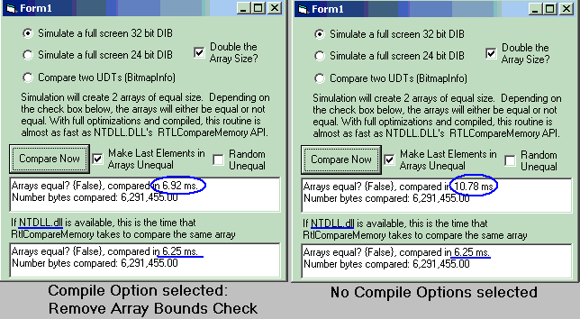



## FYI: vbMemCompare \(RTLMemCompare, MemCmp Alternative\)

### Description

Want to compare 2 same-size bitmaps for equality? Want to compare 2 arrays for equality (even if arrays are different VarTypes)? NT-based systems have RTLCompareMemory, C has MemCmp. Win9x is reduced to byte by byte loops, more or less. This twist on that loop process comes really close to matching the speed of the two aforementioned API functions and can be used in every O/S. Thought I could use this for a project of mine, but the requirement went away. Compile the project for true tests (IDE is always slower). As always, stuffed with lots of comments.
 
### More Info
 

             |
---                |---
**Submitted On**   |2006-10-01 10:41:28
**By**             |[LaVolpe](https://github.com/Planet-Source-Code/PSCIndex/blob/master/ByAuthor/lavolpe.md)
**Level**          |Intermediate
**User Rating**    |5.0 (55 globes from 11 users)
**Compatibility**  |VB 6\.0
**Category**       |[Miscellaneous](https://github.com/Planet-Source-Code/PSCIndex/blob/master/ByCategory/miscellaneous__1-1.md)
**World**          |[Visual Basic](https://github.com/Planet-Source-Code/PSCIndex/blob/master/ByWorld/visual-basic.md)
**Archive File**   |[FYI\_\_vbMem2022631012006\.zip](https://github.com/Planet-Source-Code/lavolpe-fyi-vbmemcompare-rtlmemcompare-memcmp-alternative__1-66677/archive/master.zip)

